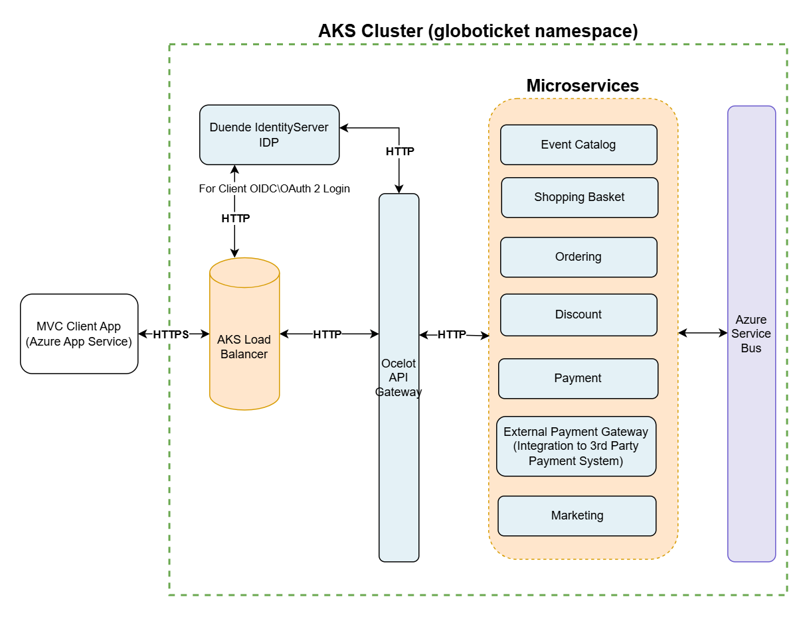

# GloboTicket ASP.NET Core Microservices Application
## Overview

GloboTicket is an event ticketing application that allows users to browse, select, and purchase tickets for a variety of events. The system demonstrates a cloud-native microservices architecture built with ASP.NET Core and deployed to Azure Kubernetes Service (AKS).

The application includes:

- Event browsing and catalog management
- Shopping basket functionality
- Order handling
- Payment processing
- Authentication using OpenID Connect
- Asynchronous messaging between services

The system is built using an Ocelot API Gateway, Duende IdentityServer for authentication, and Azure Service Bus for inter-service communication.

## Architecture Diagram

  

## Key Architecture Concepts

- Microservices architecture
- API Gateway pattern (Ocelot)
- OpenID Connect authentication
- Token exchange for downstream services
- Asynchronous messaging with Azure Service Bus
- Outbox pattern for reliable event publishing
- Polyglot persistence
- External service integration
- Kubernetes deployment (AKS)

## High Level Architecture

### MVC Client Application

The MVC Client application provides the user interface for browsing available events, managing a shopping basket, and completing ticket purchases. Users can add, update, and remove tickets from their basket, proceed to checkout, and submit payment information.

The MVC Client communicates with backend services exclusively through the Ocelot API Gateway.

Authentication is handled using Duende IdentityServer.

Test users:

User 1  
Username: Alice  
Password: Alice  

User 2  
Username: Bob  
Password: Bob

### Duende IdentityServer

Duende IdentityServer provides authentication for the GloboTicket application using OpenID Connect and OAuth 2.0. Users authenticate via the MVC Client, which redirects to IdentityServer for login.

After successful authentication, IdentityServer issues an access token intended for the Ocelot API Gateway. The MVC Client includes this token in subsequent requests to the gateway.

IdentityServer is responsible for:

- User authentication
- Token issuance
- OpenID Connect login flow
- Securing access to the API Gateway

### Ocelot Gateway

The Ocelot API Gateway acts as the single entry point into the GloboTicket microservices architecture. All client requests are routed through the gateway to the appropriate downstream services.

The MVC Client authenticates with Duende IdentityServer and receives an access token intended for the gateway. The gateway validates this token and, when required, exchanges it for downstream service tokens before forwarding requests to the appropriate microservice.

The gateway is responsible for:

- Routing requests to downstream microservices
- Validating access tokens
- Performing token exchange for downstream services
- Providing a single external endpoint for the system
- Abstracting internal service locations from clients

### Event Catalog Service

The Event Catalog service provides a list of available events that users can browse within the GloboTicket application. This service is responsible for retrieving event details such as event name, category, description, pricing, and availability.

Event data is stored in Azure Cosmos DB and accessed by the service. The MVC Client retrieves event information by sending requests through the Ocelot API Gateway, which routes the request to the Event Catalog service.

The Event Catalog service is responsible for:

- Retrieving available events
- Providing event details and pricing
- Managing event categories
- Serving event data to the MVC Client via the API Gateway

### Shopping Basket Service

The Shopping Basket service manages a user's shopping cart and provides operations to create, read, update, and delete basket data. Basket information is stored in Azure Cache for Redis for fast access and short-lived persistence.

Users can add and remove tickets, update quantities, and apply discount coupons to their basket. During checkout, the Shopping Basket service retrieves user-specific discounts from the Discount service based on the authenticated user's identity.

After calculating totals and applying any discounts, the service publishes a checkout message to Azure Service Bus. This message is consumed by the Ordering service to begin order processing.

The Shopping Basket service is responsible for:

- Managing basket creation and updates
- Adding and removing ticket items
- Applying user-specific discounts
- Storing basket data in Redis
- Publishing checkout messages to Azure Service Bus

### Ordering Service

The Ordering service is responsible for creating and managing customer orders. It processes checkout messages published by the Shopping Basket service and creates orders based on the selected tickets. Order data is persisted in Azure SQL Database.

When a checkout message is received, the Ordering service creates a new order and publishes a payment request message to the Payment service. After payment processing is completed, the Payment service sends a response message back to the Ordering service, which updates the order payment status accordingly.

The Ordering service also listens for event update messages published by the Integration Event Publisher service. These updates ensure that event information stored with existing orders remains synchronized when event details change.

The Ordering service is responsible for:

- Creating orders from checkout messages
- Persisting order and customer information
- Publishing payment requests to the Payment service
- Updating order status based on payment responses
- Maintaining a local copy of event information for orders
- Handling event update messages from the integration event publisher

### Payment Service

The Payment service is a background worker that processes payment requests for orders. It listens for payment request messages published by the Ordering service.

When a payment request is received, the Payment service calls the External Payment Gateway service to simulate a third-party payment processor such as PayPal or Stripe. After the payment is processed, the service publishes a payment update message back to the Ordering service.

The Ordering service then updates the order status based on the payment result.

The Payment service is responsible for:

- Listening for payment request messages from the Ordering service
- Calling the External Payment Gateway to process payments
- Publishing payment result messages
- Enabling asynchronous order payment processing

### External Payment Gateway Service

The External Payment Gateway service simulates a third-party payment processor such as PayPal or Stripe. The Payment service calls this API to determine whether a payment succeeds or fails.

For demonstration purposes, the service randomly returns a successful payment result approximately 80% of the time and a failed payment result 20% of the time. This allows the system to simulate real-world payment scenarios and verify order processing behavior in the MVC Client.

This service is responsible for:

- Simulating an external payment provider
- Returning payment success or failure responses
- Enabling end-to-end payment workflow testing
- Supporting asynchronous payment processing

*In a production scenario, this service would be replaced with integration to a real payment provider such as PayPal, Stripe, etc.

### Discount Service

The Discount service provides user-specific discounts that are applied during basket checkout. The Shopping Basket service calls the Discount service to retrieve discount information for the authenticated user.

Discount data is stored in Azure SQL Database and consists of user-specific coupon information, including user ID, coupon ID, and discount amount.

This service is responsible for:

- Providing user-specific discount information
- Supporting basket checkout calculations
- Enabling promotional pricing scenarios

### Marketing Service

The Marketing service tracks user basket activity and supports marketing scenarios such as promotions, recommendations, and abandoned cart workflows.

Originally, the Marketing service monitored basket changes by polling the Shopping Basket service for persisted basket change events stored in a relational database. After migrating the Shopping Basket service to Azure Cache for Redis, this polling approach no longer provided change tracking.

A more appropriate architecture is for the Shopping Basket service to publish basket change events to Azure Service Bus. The Marketing service can then subscribe to these events and react to basket updates in real time.

This service is responsible for:

- Tracking user basket activity
- Supporting promotional and recommendation scenarios
- Processing basket change events
- Enabling future marketing workflows such as abandoned cart notifications

### Integration Event Publisher Service

The Integration Event Publisher service implements the Outbox Pattern to reliably publish integration events to Azure Service Bus. This service ensures that domain changes within a microservice are safely persisted before being published as messages.

The service runs as a background worker that periodically checks for unpublished integration events stored in Azure Cosmos DB. When unpublished events are found, the service publishes them to the appropriate Azure Service Bus topic and updates their status to prevent duplicate delivery.

This approach guarantees that events are not lost in the event of failures between database updates and message publishing.

The Integration Event Publisher service is responsible for:

- Implementing the Outbox Pattern
- Reading unpublished integration events from Cosmos DB
- Publishing events to Azure Service Bus topics
- Updating event status after successful publishing
- Preventing duplicate message delivery
- Enabling reliable event-driven communication between services

## Authentication Flow

The GloboTicket system uses OpenID Connect with token exchange to securely propagate identity across microservices.

1. User accesses MVC Client
2. MVC Client redirects to Duende IdentityServer
3. User authenticates
4. IdentityServer issues access token for Ocelot Gateway
5. MVC Client sends token to gateway
6. Gateway validates token
7. Gateway exchanges token for downstream services
8. Gateway forwards request to microservices
9. Downstream microservices validate the exchanged token
10. Request is processed and response returned to the client

## Request Flow

## API Documentation

Each microservice exposes Swagger/OpenAPI documentation.

Since services are internal to the cluster, Swagger can be accessed using kubectl port-forward.

Example:

kubectl port-forward svc/svc-globoticket-services-eventcatalog 7001:5001 -n globoticket

Then open:

http://localhost:7001/swagger
